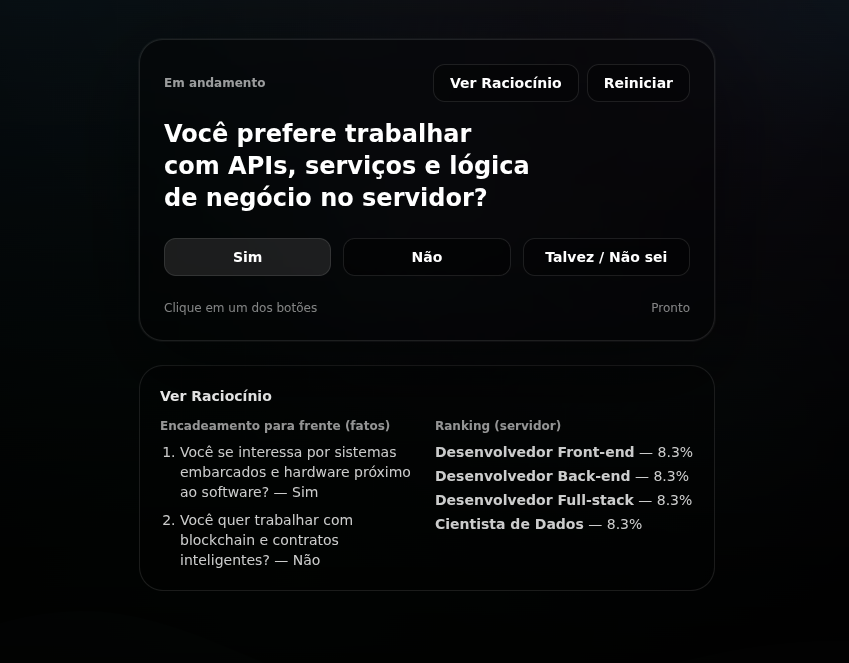

# Career Compass


Sistema especialista para carreiras em TI com **encadeamento para frente** (fatos → regras → evidências por carreira), **próxima pergunta escolhida por entropia** e **API no servidor**:

- **Encadeamento para frente**: cada resposta satisfez premissas de regras em `data/knowledge.json` (e regras moderadas no MongoDB); a resposta da API inclui `cadeiaInferencia` com a ordem dos disparos.
- **Seleção por entropia**: entre perguntas ainda não respondidas, escolhe a que minimiza a entropia esperada da distribuição sobre as carreiras (prior Sim / Não / Talvez).
- **Pesos e ranking**: Sim = +peso, Não = −peso, Talvez = fração do peso;
- **Sessão**: estado (`respostas` + `carreiras descartadas`) em **MongoDB** (`QuizSession`). Em **Vercel** (ou qualquer ambiente serverless) é **obrigatório** `DATABASE_URL` apontando para um MongoDB acessível: sessões só em memória **não** funcionam entre requisições (cada instância tem seu próprio processo).
- **API do quiz**: `POST /api/quiz` com `action`: `start` | `answer` | `discard`.

Resposta JSON inclui: `proximaPergunta`, `rankingAtual`, `status` (`em_andamento` | `conclusao_encontrada` | `esgotado`), `carreiraProposta`, `cadeiaInferencia`.



## Rotas

### Páginas (App Router)

| Rota     | Descrição                                      |
|----------|------------------------------------------------|
| `/`      | Quiz, resultado e fluxo “ensinar carreira”.    |
| `/admin` | Painel de moderação (token `MODERATOR_TOKEN`). |

### API (Route Handlers)

| Método e caminho              | Descrição |
|-------------------------------|-----------|
| `POST /api/quiz`              | Corpo JSON: `{ "action": "start" }`, `{ "action": "answer", "sessionId", "questionId", "answer": "yes"\|"no"\|"maybe" }` ou `{ "action": "discard", "sessionId", "careerId" }`. |
| `POST /api/suggestions`       | Sugestão de carreira + contexto (requer `DATABASE_URL`). |
| `GET /api/moderator/suggestions` | Lista sugestões (header `x-moderator-token`). |
| `POST /api/moderator/suggestions`| `action`: `approve` ou `delete` + `suggestionId`. |

## Estrutura principal do projeto

```text
.
├── assets/                     # Screenshots .png para documentação (README)
├── app/
│   ├── admin/page.tsx          # Painel /admin
│   ├── api/
│   │   ├── quiz/route.ts       # Motor + sessão
│   │   ├── suggestions/route.ts
│   │   └── moderator/suggestions/route.ts
│   ├── quiz/types.ts         # Tipos compartilhados com a UI do quiz
│   ├── layout.tsx
│   ├── page.tsx              # Home (quiz)
│   └── globals.css
├── components/ui/              # Aurora, Wavy, Button, cn, etc.
├── data/knowledge.json         # Perguntas, carreiras, regras (JSON)
├── lib/
│   ├── inference/
│   │   ├── engine.ts           # Orquestração, entropia, ranking, runEngine
│   │   ├── forward-chaining.ts
│   │   ├── knowledge-repository.ts  # Base efetiva (JSON + Mongo moderador)
│   │   ├── session-store.ts   # QuizSession ou memória
│   │   └── types.ts
│   ├── moderator-auth.ts
│   └── prisma.ts
├── prisma/
│   └── schema.prisma           # MongoDB (Prisma)
├── next.config.mjs
├── package.json
├── tsconfig.json
└── .env.example
```

## Stack, versões e bibliotecas

Requisito de runtime: **Node.js 20+** (alinhado ao motor do Prisma / Next).

Versões abaixo conforme `package.json` (intervalos `^`; o lockfile fixa resolução exata após `npm install`).

| Tecnologia        | Versão (package.json) | Uso |
|-------------------|------------------------|-----|
| **Next.js**       | ^15.2.3               | App Router, SSR/SSG, API Routes |
| **React/DOM**         | ^19.0.0               | UI |
| **TypeScript**    | ^5.8.2                | Tipagem |
| **Prisma**        | ^6.3.1 (`prisma` + `@prisma/client`) | ORM, MongoDB |
| **Tailwind CSS**  | ^3.4.17               | Estilos |
| **PostCSS**       | ^8.5.3                | Pipeline CSS |
| **Autoprefixer**  | ^10.4.21              | Prefixos CSS |
| **Framer Motion** | ^12.6.4               | Animações (quiz / fundo) |
| **clsx**          | ^2.1.1                | Classes condicionais |

Tipos: `@types/node` ^22.13.10, `@types/react` ^19.0.12, `@types/react-dom` ^19.0.4.

## Conhecimento

- Fonte: `data/knowledge.json` — `questions`, `careers` e `rules` (uma regra liga `careerId` + `questionId` com `weight`).
- Conteúdo moderado: modelos `ModeratorCareer` e `ModeratorRule` no `schema.prisma`, mesclados em `getEffectiveKnowledgeBase()`.

## Rodar localmente

Requisitos: Node.js 20+, MongoDB Atlas (recomendado) e `DATABASE_URL` no `.env`.
```
git clone https://github.com/d4n13lx/CompassAI.git
```
### Windows
```bash
copy .env.example .env

npm install
npx prisma db push
npm run dev
```
### Linux
```bash
cp .env.example .env

npm install
npx prisma db push
npm run dev
```

## Variáveis de Ambiente

| Variável          | Uso |
|-------------------|-----|
| `DATABASE_URL`    | MongoDB (sessões, sugestões, moderação) |
| `MODERATOR_TOKEN` | Token para `GET`/`POST` `/api/moderator/suggestions` e campo na UI `/admin` (header `x-moderator-token`) |

## Deploy (Vercel)

1. Importe o repositório na Vercel.
2. Configure `DATABASE_URL` e `MODERATOR_TOKEN` no painel (**Environment**: Production e Preview, se usar deploy de branch).
3. Rode `npx prisma db push` uma vez contra o cluster (local ou CI) para criar coleções (`QuizSession`, etc.).

### Se `POST /api/quiz` retornar 500

- **MongoDB inacessível**: string `DATABASE_URL` errada, usuário/senha, ou IP bloqueado no Atlas (**Network Access** → permitir `0.0.0.0/0` para testar).
- **Schema não aplicado**: sem `db push`, o `create` em `QuizSession` pode falhar.
- **Resposta JSON**: o corpo costuma trazer `error` com uma dica (a Vercel também mostra o stack em *Functions → Logs*).

## Scripts

```bash
npm run dev        # desenvolvimento
npm run dev:fresh  # apaga .next e sobe o dev (cache)
npm run build      # prisma generate + next build
npm run start      # produção (após build)
npm run lint       # ESLint
npm run typecheck  # prisma generate + tsc --noEmit
npm run db:push    # sincroniza schema Prisma → MongoDB
```
